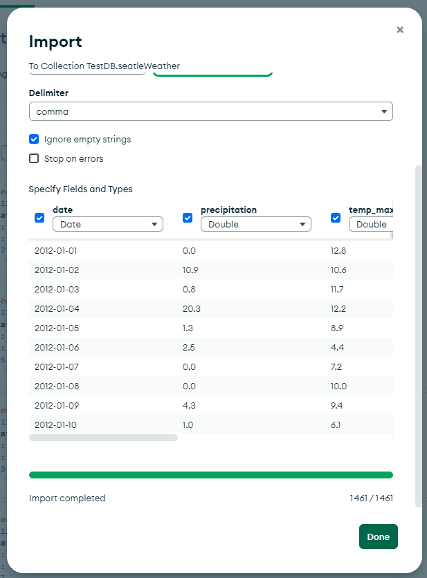
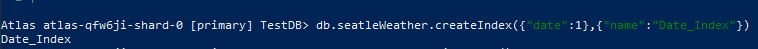
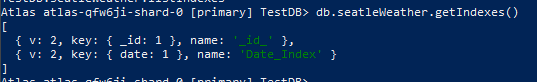
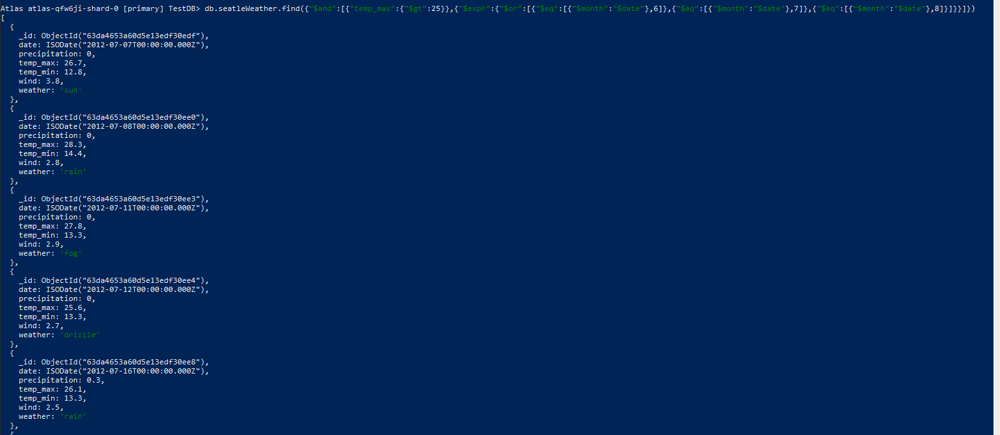
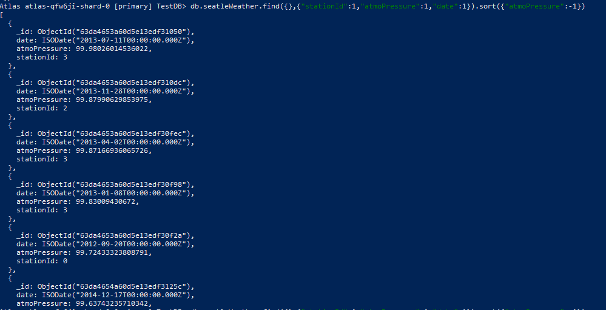
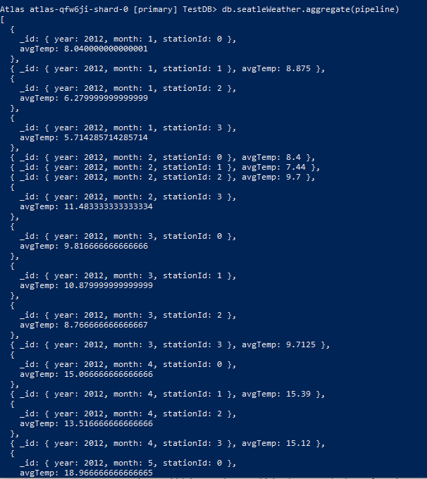
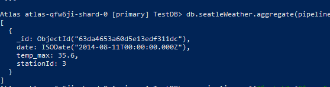
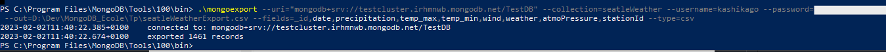

# TP Météo

## Préparation des données

Pour ce TP nous allons utiliser les données météos de Seatle (https://www.kaggle.com/datasets/ananthr1/weather-prediction)



Avant l'importation on défini les types pour chaque champ.

## Indexation des données météo

### Création d'un index sur la collection

Création d'un index pour les dates des données météo avec le fonction `createIndex()`.


### Listing des index de la collection

Listing des indexes présent sur la collection seatleWeather


## Requête MongoDB

### A) Recherche des température supérieur à 25C° durant l'été

Recherche des enregistrement de valeur supérieur à 25C° durant la période d'été (Juin,Juillet et Août)

```bash
##
db.seatleWeather.find(
    {"$and":
        [{"temp_max":{"$gt":25}},
            {"$expr":
                {"$or":
                    [{"$eq":[{"$month":"$date"},6]},
                    {"$eq":[{"$month":"$date"},7]},
                    {"$eq":[{"$month":"$date"},8]}]
                }
           }
        ]
    })
```

**Résultat de la requête:**


### B.1) Insertion de la pression atmosphérique dans les documents de la collection

La collection de document ne possède pas de donnée au sujet de la pression atmosphérique et l'identifiant de station météo.
Pour palier à ce manque voici la commande qui ajoute une valeur aléatoire pour la pression atmosphérique et l'identification des stations.

```bash
## Ajout de la pression atmosph"rique
db.seatleWeather.updateMany({},[{"$set":{"atmoPressure":{"$multiply":[{"$rand":{}},100]}}}])
## Ajout de l'ID des stations météo
db.seatleWeather.updateMany({},[{"$set":{"stationId":{"$floor":{"$multiply":[{"$rand":{}},4]}}}}])
```

### B.2) Triage des stations métérologique par pression atmosphérique

```bash
db.seatleWeather.find({},{"stationId":1,"atmoPressure":1,"date":1}).sort({"atmoPressure":-1})
```

**Résultat de la requête:**


## Framework d'agrégation

### A) Calcule de la moyenne des températures de chaque station météo pour chaque mois.

**La pipeline définie pour l'agrégation suit la précèdure suivante:**

1. On regroupe les document par **stationId**, **Année** et **Mois** puis on calcule la moyenne des température enregistrés durant le mois par la station méteo.
2. On tri par **\_id** des stations.

```js
//Pipeline utilisé par le framework d'agrégation
var pipeline = [
  {
    $group: {
      _id: {
        year: { $year: "$date" },
        month: { $month: "$date" },
        stationId: "$stationId",
      },
      avgTemp: { $avg: "$temp_max" },
    },
  },
  { $sort: { _id: 1 } },
];

db.seatleWeather.aggregate(pipeline);
```

**Résultat de la requête:**


### B) Retrouver la station météo qui a enregisté la plus haute température en été.

**La pipeline définie pour l'agrégation suit la précèdure suivante:**

1. On récupère les documents dont le mois est égal au 6 ,7 et 8 (Juin,Juillet, Août).
2. On tri par **temp_max** par ordre décroissant.
3. On limite le nombre document dans la pipeline à 1.
4. On affiche la **stationId**, **temp_max** et la **date**.

```js
//Pipeline utilisé par le framework d'agrégation
var pipeline = [
  {
    $match: {
      $expr: {
        $or: [
          { $eq: [{ $month: "$date" }, 6] },
          { $eq: [{ $month: "$date" }, 7] },
          { $eq: [{ $month: "$date" }, 8] },
        ],
      },
    },
  },
  { $sort: { temp_max: -1 } },
  { $limit: 1 },
  { $project: { stationId: 1, temp_max: 1, date: 1 } },
];

db.seatleWeather.aggregate(pipeline);
```

**Résultat de la requête:**


## Exportation de la collection

Exportation de la collection en format CSV de la collection seatleWeather.

